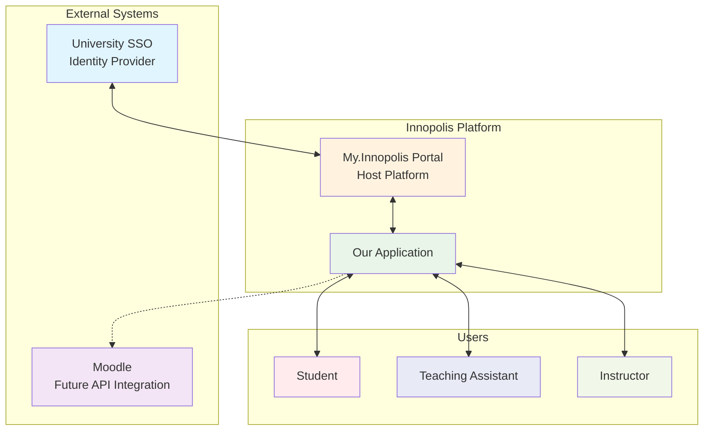

  Interactive Course Grading

  

    <em>A simplified, integrated LMS for the Interactive IT Product Dev course, designed to streamline individual and group grade management.</em>

## Project Goal

The primary goal of MyMini is to replace the cumbersome Google Sheets-based grade tracking system for the ITPD course with a lightweight, purpose-built Learning Management System (LMS). It aims to provide a clear, secure, and efficient way for students, TAs, and instructors to manage assignments, submissions, and grades—especially for courses that involve both individual and group work.

## Threshold of Success

The project will be considered successful when:
*   TAs and the instructor no longer need to use Google Sheets for managing ITPD grades.
*   Students can reliably view their individual and group grades without seeing the grades of other students.
*   The core workflows — submission upload, peer review assignment, and grading—are fully functional and intuitive for all user roles.
*   The system is successfully integrated into the `my.innopolis.university` portal using the university's Single Sign-On (SSO).

## Description

MyMini is a focused LMS layer developed specifically for the needs of the Interactive IT Product Dev (ITPD) course at Innopolis University. It directly addresses the pain points of managing complex grading schemes in a shared Google Sheet by providing distinct, role-based views and actions.

The system is not intended to replicate the full feature set of Moodle but to offer a simplified and superior experience for the specific grading, submission, and peer-review tasks of this course. Future integration with the Moodle API is planned to synchronize data and avoid duplicate entry.

## Project Context Diagram

The following diagram illustrates the key stakeholders and external systems that interact with MyMini:

**Stakeholders & Systems:**
*   **Students:** Can view assignments, upload submissions, see their own grades, and submit peer reviews.
*   **Teaching Assistants (TAs):** Can create assignments, grade submissions, manage groups, and assign peer reviews.
*   **Instructor:** Has all TA abilities plus the ability to assign TAs to the course.
*   **My.Innopolis Portal:** The primary platform where MyMini will be integrated.
*   **University SSO:** Provides authentication for all users.
*   **Moodle (Future):** An external system for potential future data synchronization.

## Feature Roadmap

### MVP

*   [x] Project Repository & Branch ruleset (Branch protection, peer review)
*   [x] Initial Project Documentation & Interview Analysis
*   [ ] **Student Features:**
    *   [ ] Dashboard to view assignments and grades (individual & group)
    *   [ ] File upload for assignments
    *   [ ] Peer review submission interface
*   [ ] **TA Features:**
    *   [ ] Simple gradebook view (students vs. assignments)
    *   [ ] Assignment creation
    *   [ ] Submission grading (individual & group scores)
    *   [ ] Group management
    *   [ ] Peer review assignment
*   [ ] **Instructor Features:**
    *   [ ] All TA features
    *   [ ] TA management for the course
*   [ ] **System Features:**
    *   [ ] Integration with University SSO
    *   [ ] Deployment within `my.innopolis.university`

### **Future Enhancements**
*   [ ] Moodle API integration for data synchronization
*   [ ] Enhanced UI/UX and dashboard analytics
*   [ ] Notifications and reminder system

## Documentation

Comprehensive documentation for this project is maintained in the [`./docs`](./docs) directory.

*   [`./docs/sprints/`](./docs/sprints/): This folder contains detailed records of our development progress, including sprint goals, task breakdowns, and meeting notes.
*   [`./docs/ai-usage.md`](./docs/ai-usage.md): This file transparently documents how AI tools were utilized throughout the project's lifecycle, in accordance with the course assignment requirements.

---

<em>Innopolis, 2025</em>

