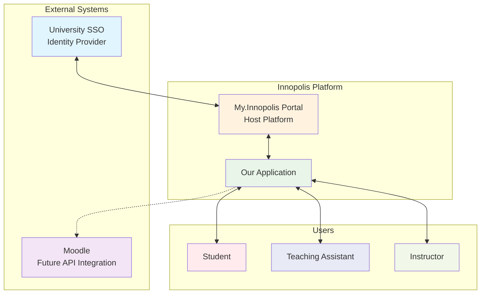

  Interactive Course Grading

  

    <em>A simplified, integrated LMS for the IT Product Dev course, designed to streamline individual and group grade management.</em>

## Description

The system will provide a focused LMS layer developed specifically for the needs of the IT Product Dev course at Innopolis University. It directly addresses the pain points of managing complex grading schemes in a shared Google Sheet by providing distinct, role-based views and actions.

The system is not intended to replicate the full feature set of Moodle but to offer a simplified and superior experience for the specific grading, submission, and peer-review tasks of this course. Future integration with the Moodle API is planned to synchronize data and avoid duplicate entry.

## Project Context Diagram

The following diagram illustrates the key stakeholders and external systems that interact with MyMini:

**Stakeholders & Systems:**
*   **Students:** Can view assignments, upload submissions, see their own grades, and submit peer reviews.
*   **Teaching Assistants (TAs):** Can create assignments, grade submissions, manage groups, and assign peer reviews.
*   **Instructor:** Has all TA abilities plus the ability to assign TAs to the course.
*   **My.Innopolis Portal:** The primary platform where MyMini will be integrated.
*   **University SSO:** Provides authentication for all users.
*   **Moodle (Future):** An external system for potential future data synchronization.

## Documentation

Documentation for this project can be found [here](https://iu-mymini.github.io/InteractiveCourseGrading/).

---

<em>Innopolis, 2025</em>

