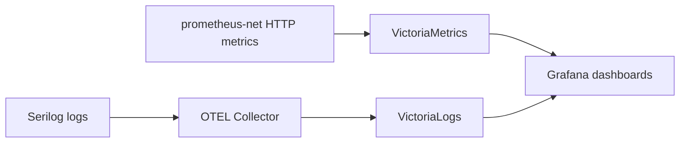
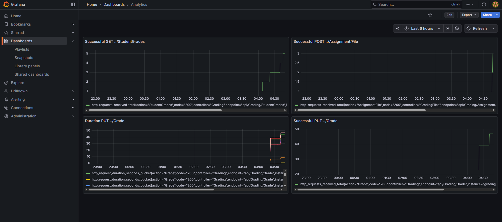

# Analytics

## Define the Value

**Value:**
Our product delivers value by simplifying the grading workflow for university courses. It replaces the manual process where instructors use Google Sheets and later transfer grades to Moodle. The system allows instructors to grade student submissions more efficiently and reduces errors in final grading.

**Value Moment:**
The value moment occurs when a TA or instructor submits a grade for a student using the `api/Grading/Grade` endpoint, and the student can view the feedback. At this moment, the instructor completes a grading task efficiently and the student receives actionable feedback.

## Brainstorm Metrics

### Possible Metrics

1. `http_requests_received_total{code="200", endpoint="api/Grading/Grade"}` – total number of successful assignment grading requests.
2. `http_requests_received_total{code="500", endpoint="api/Grading/Grade"}` – number of errors encountered during grading.
3. `http_requests_received_total{code="200", endpoint="api/Grading/Grade"}` – latency of grading requests.
4. `http_requests_received_total{code="200", endpoint="api/Grading/StudentGrades"}` – number of times students view their grades.

### North Star Metric (NSM)

* **Metric:** `http_requests_received_total{code="200", endpoint="api/Grading/Grade"}`
* **Reason:** Directly measures the number of assignments successfully graded, representing the core value of the system. It is a leading indicator and actionable.

### Counter Metric

* **Metric:** `http_requests_received_total{code="500", endpoint="api/Grading/Grade"}`
* **Reason:** Tracks errors to prevent over-optimizing for NSM and ensures reliability.

## Metric Tree

| Input Metric                                                            | Type      | Relation to NSM                                     |
| ----------------------------------------------------------------------- | --------- | --------------------------------------------------- |
| `http_requests_total{endpoint="endpoint="api/Grading/Grade", code="200"}`     | Counter   | More uploads increase potential assignments graded. |
| `http_requests_total{endpoint="api/Grading/Grade", code="200"}`      | Counter   | Successful grading directly contributes to NSM.     |
| `http_request_duration_seconds{endpoint="api/Grading/Grade"}`          | Histogram | High latency may reduce grading throughput.         |
| `http_requests_total{endpoint="endpoint="api/Grading/Grade", code="200"}` | Counter   | Indicates engagement but indirectly supports NSM.   |

## Plan Measurements

* **Data Needed:** HTTP request counts, status codes, request durations for grading endpoints.
* **Volume:** Collect metrics for all requests to grading endpoints; minimum 1 week of traffic for trend analysis.
* **Collection & Processing:** Metrics are exposed via `prometheus-net` on the backend and scraped by VictoriaMetrics. Structured logs from Serilog are sent via OTEL protobuf to VictoriaLogs for auditing and error tracking. Data is visualized in Grafana.

## Plan Code Changes

* No custom metrics required; default `http_requests_total` metrics from prometheus-net are used.
* Ensure backend API exposes metrics endpoint for VictoriaMetrics scraping.
* Serilog logs structured events for errors, grading submissions, and user actions; sent to VictoriaLogs via OTEL.
* Telemetry collection is enabled in production; can be toggled off in development via configuration.

## Links for charts

> NOTE: Since we are using internal monitoring system, to preserve privacy of our data, we will only provide screenshots. To prove that they are real, we can showcase them during lecture.

### Grafana

