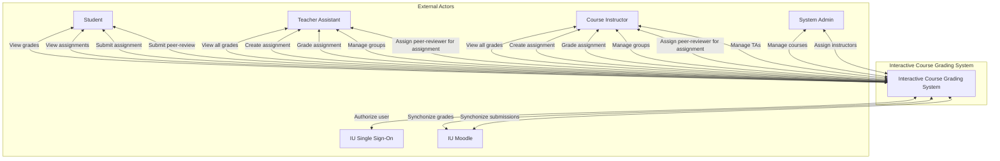
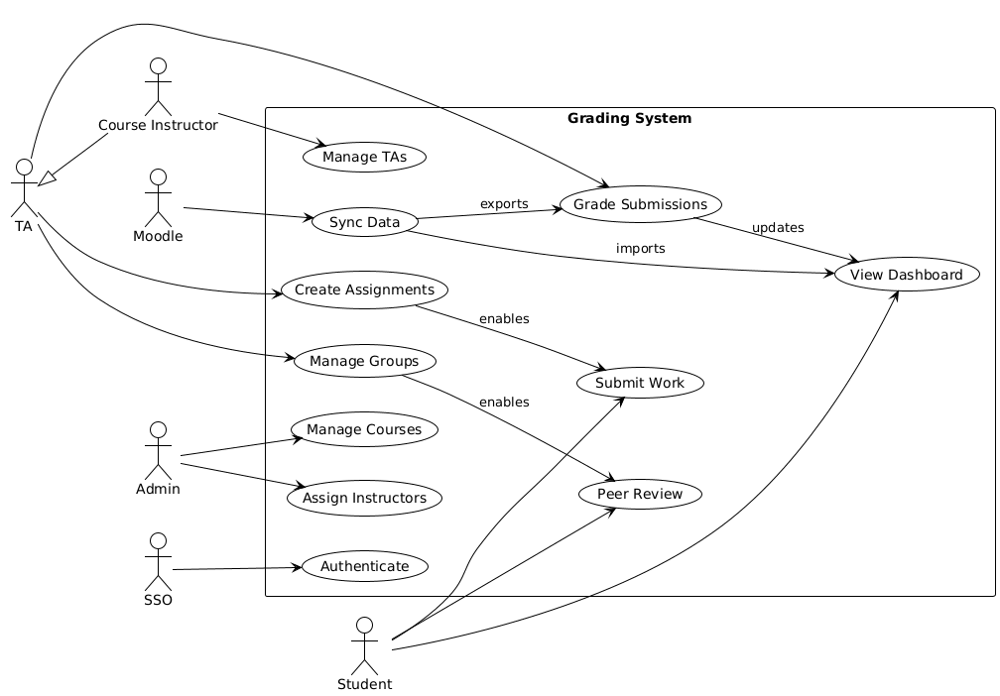
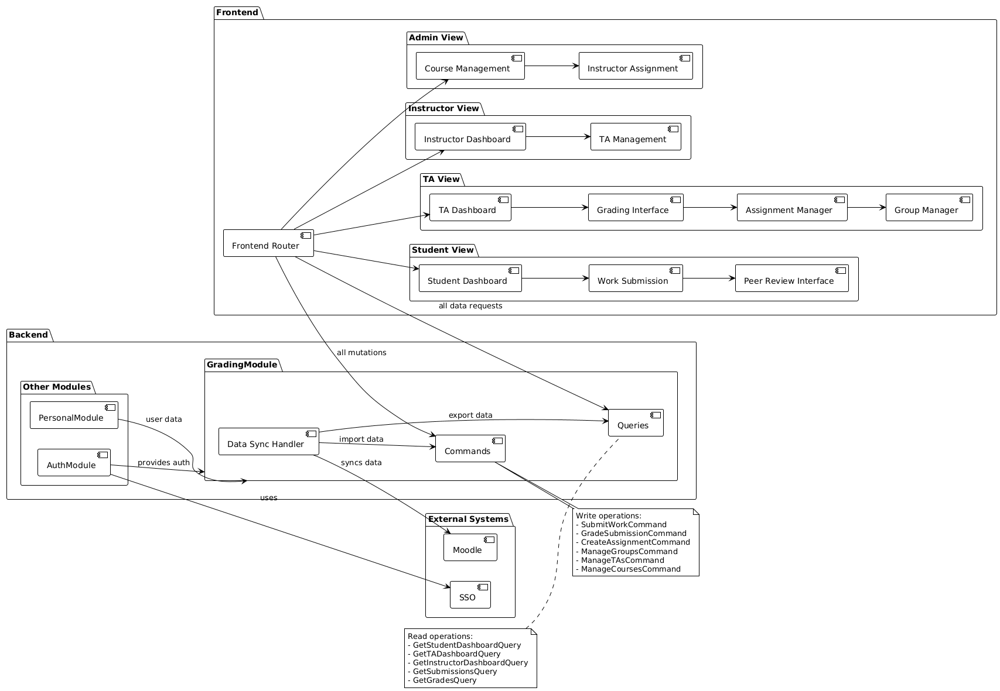
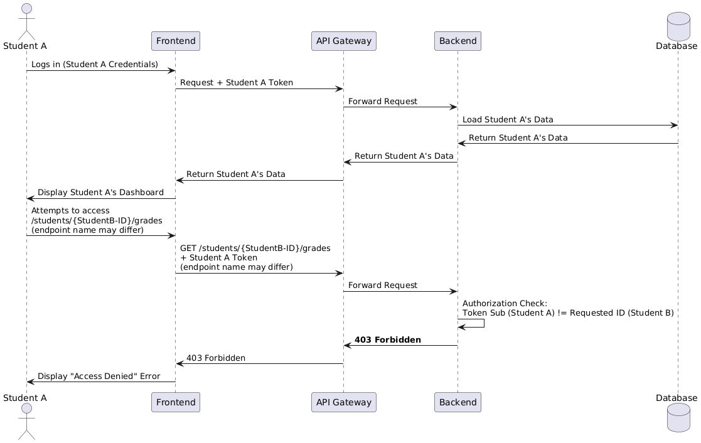
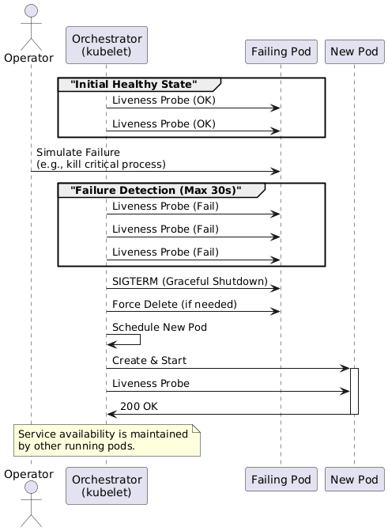
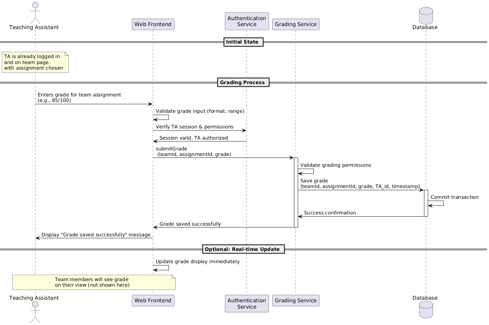
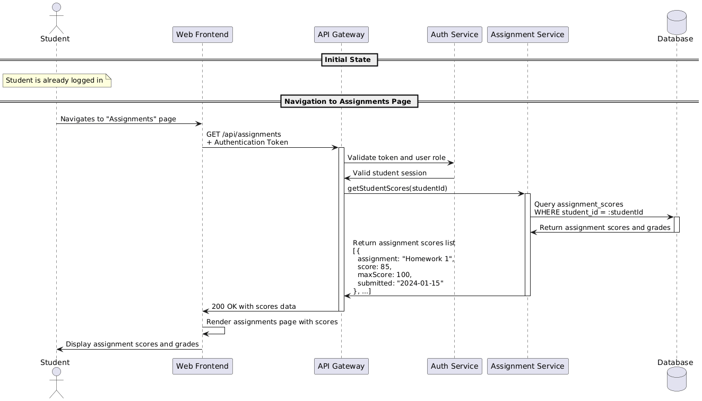

# Architecture

## Table of contents

* [Interactive prototype](#interactive-prototype)
* [Context diagram](#context-diagram)
* [Use case diagram](#use-case-diagram)
* [Component diagram](#component-diagram)
* [Sequence diagrams](#sequence-diagrams)
    * [QAST002-1](#qast002-1)
    * [QAST005-1](#qast005-1)
* [Design decisions](#design-decisions)

## Interactive prototype

Figma
prototype: [Grading Module Design](https://www.figma.com/design/tQQktvmjVIhOpM61luAvF8/InteractiveCourseGradingDesign?node-id=0-1&t=2s9zfvzOJvSswROL-1)

## Context diagram

## Use case diagram

### Component diagram

### Sequence diagrams

#### QAST002-1

#### QAST005-1

#### User Story: Grading

#### User Story: Grades View

## Design decisions

| Driver | Decision | Rationale | Discarded Alternatives |
|--------|----------|-----------|------------------------|
| **SEC-1:** Secure & Seamless User Authentication | Integrate with the existing **Innopolis University Single Sign-On (SSO)** | - Leverages existing, secure university infrastructure - Provides a seamless UX for students and staff (no new account needed) - Avoids the high risk and maintenance burden of managing credentials | - **Custom email/password system:** High security risk, poor UX, and difficult to maintain user lists - **Third-party OAuth (e.g., Google):** Doesn't confirm user's role within the university |
| **SEC-2:** Role-Based Data Privacy | Implement a strict **Role-Based Access Control (RBAC)** system | - Critical requirement: Students *must* only see their own grades - Provides distinct, tailored functionality for Students, TAs, Instructors, and Admins - Simplifies permission management | - **No RBAC:** Insecure and leaks private student data - **Manual permissioning:** Does not scale and is error-prone |
| **CON-1:** Integration with `my.innopolis.university` | Build the application as an **independent service/module** to be plugged into the existing portal | - Allows for independent development, deployment, and scaling - Focuses effort on the core business problem (grading) - Provides a unified entry point for users via the main portal | - **Monolithic architecture:** Impossible, as we don't own the main university portal - **Full microservices:** Over-engineering for a single, well-defined problem domain |
| **QA-1:** Universal Accessibility | Develop a **responsive web application** as the primary user interface | - Accessible from any device (laptop, tablet, phone) via a web browser - No installation required for users - Single codebase is easier to maintain and update | - **Native mobile app:** High development overhead, less practical for TAs/Instructors performing complex grading tasks - **Desktop application:** Poor accessibility for students |
| **INT-1:** Single Source of Truth | Architect for **future API synchronization with Moodle** | - Moodle is the university's system of record for final grades - Syncing grades avoids double data entry for TAs and Instructors - Centralizes submissions and grades over the long term | - **No Moodle integration:** Creates a competing "source of truth" and requires manual CSV export/import, which is error-prone - **Direct DB access:** Infeasible and highly insecure |
