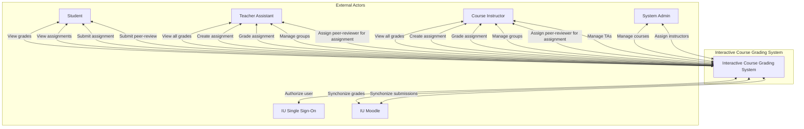

# Architecture

## Table of contents

* [Interactive prototype](#interactive-prototype)
* [Context diagram](#context-diagram)
* [Use case diagram](#use-case-diagram)
* [Component diagram](#component-diagram)
* [Sequence diagrams](#sequence-diagrams)
    * [QAST002-1](#qast002-1)
    * [QAST005-1](#qast005-1)

## Interactive prototype

Figma
prototype: [Grading Module Design](https://www.figma.com/design/tQQktvmjVIhOpM61luAvF8/InteractiveCourseGradingDesign?node-id=0-1&t=2s9zfvzOJvSswROL-1)

## Context diagram

## Use case diagram

### Component diagram

### Sequence diagrams

#### QAST002-1

#### QAST005-1

