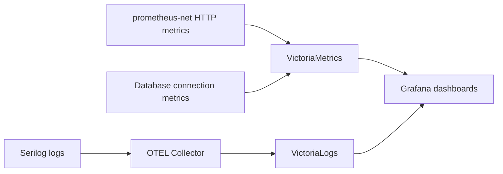
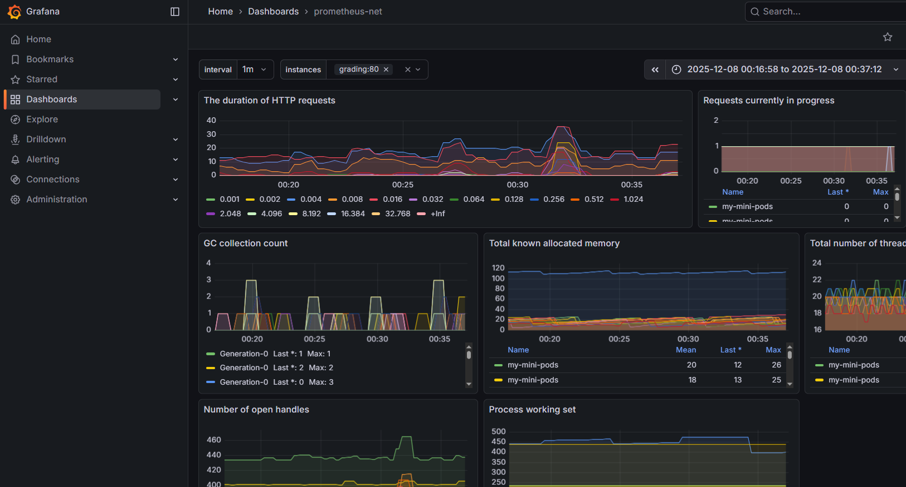
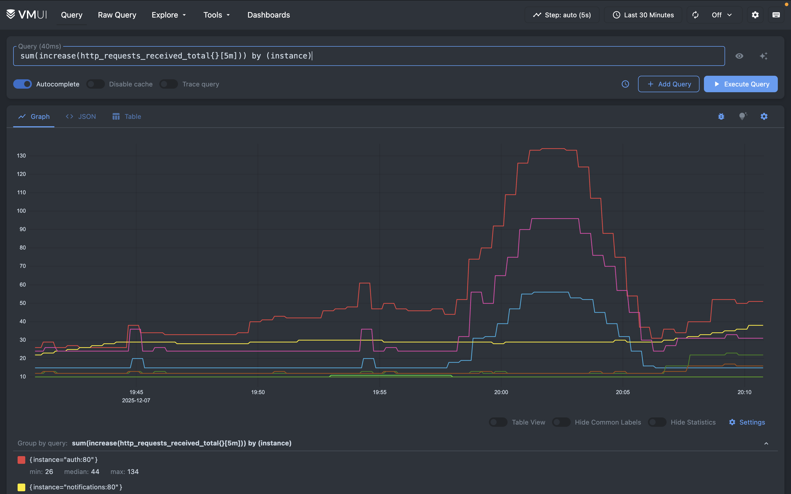
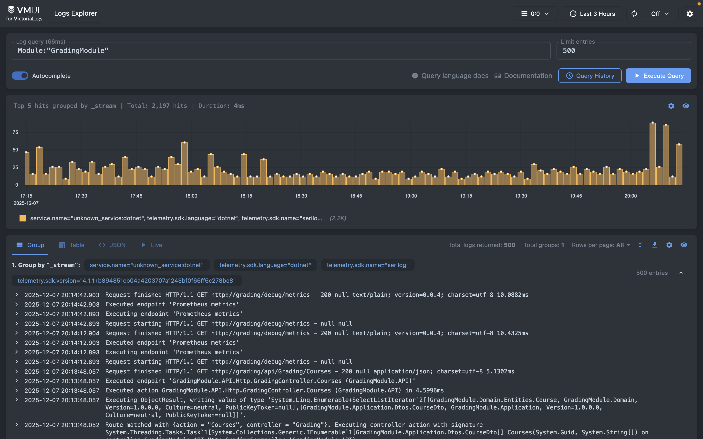

<!-- Fix metrics -->

# Observability

## Brainstorm: Top Technical Risks

1. **High API Latency** – grading requests may take too long, delaying feedback.
2. **Database Connection Saturation** – too many concurrent connections may cause failures.
3. **Memory Usage Spikes** – high memory usage may trigger pod restarts.
4. **Grading Errors** – incorrect grades or failed submissions.
5. **Logging Delivery Failures** – Serilog logs not reaching VictoriaLogs.

## Objectives: Most Critical Risks

**Critical Risk 1: High API Latency**

* **SLO:** To monitor high API latency, we will track `http_request_duration_seconds{endpoint="api/Grading/Grade"}`. It must remain below 2 seconds for 99% of requests.

**Critical Risk 2: Database Connection Saturation**

* **SLO:** To monitor DB connections, we will track the number of active database connections per backend pod. Connections must remain below 80% of the pool capacity at all times.

## Plan Instrumentation

* **Metrics Calculation:**

  * Use `prometheus-net` HTTP request metrics for API latency.
  * Database connection metrics exported via backend monitoring (e.g., custom gauge if necessary).
* **Logs Context:**

  * Serilog structured logs contain endpoint, user ID, submission ID, error details, and DB connection events.
  * Useful when SLOs are violated to debug issues.
* **Data Collection Pipeline:**

## Plan Alerts

* **API Latency Alert:** p95 > 1.5s for 5 minutes → Telegram notification.
* **DB Connection Alert:** > 80% pool usage for 5 minutes → Telegram notification.
* **Other Alerts:**

  * Memory usage > 80% for 5 minutes → alert.
  * Grading errors > 5 in 10 minutes → alert.

**Alert Delivery:**

* Alerts sent via Telegram using a bot and pre-configured Chat ID.

## Plan Response: Example Scenario

**Scenario:** API latency exceeds threshold.

* **Notification:** Telegram alert sent to the team.
* **First Steps:**

  1. Inspect Grafana dashboards for latency trends.
  2. Check VictoriaLogs for Serilog logs and DB connection events.
  3. Identify possible backend or DB bottlenecks.
  4. Apply fixes: optimize queries, scale pods, or restart affected services.

## Links for charts

> NOTE: Since we are using internal monitoring system, to preserve privacy of our data, we will only provide screenshots. To prove that they are real, we can showcase them during lecture.

### Grafana

### VictoriaMetrics

### VictoriaLogs

